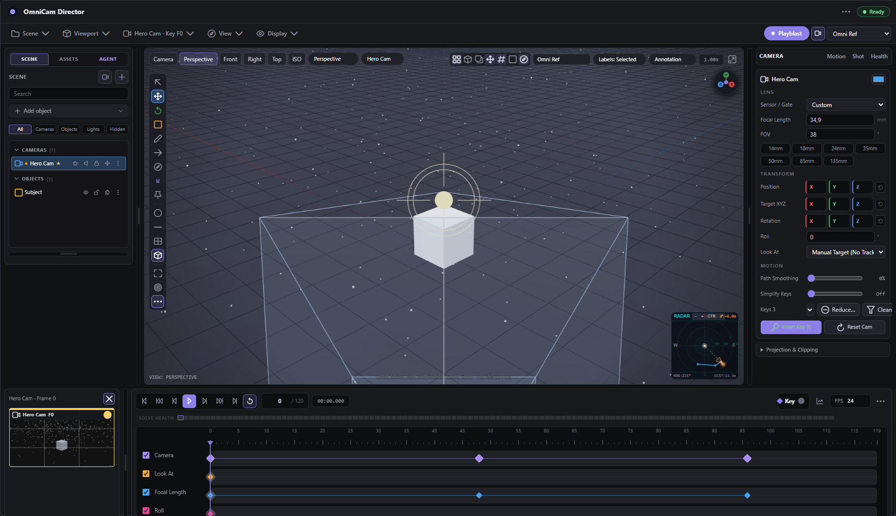
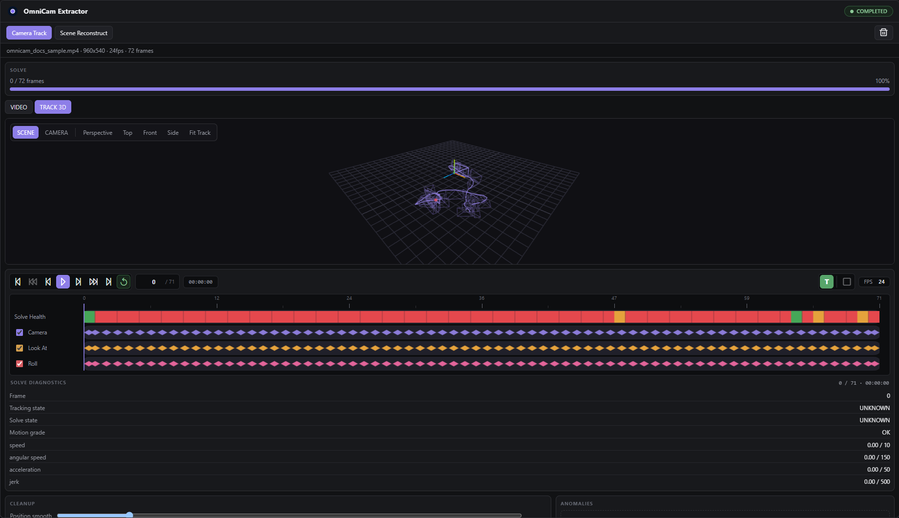
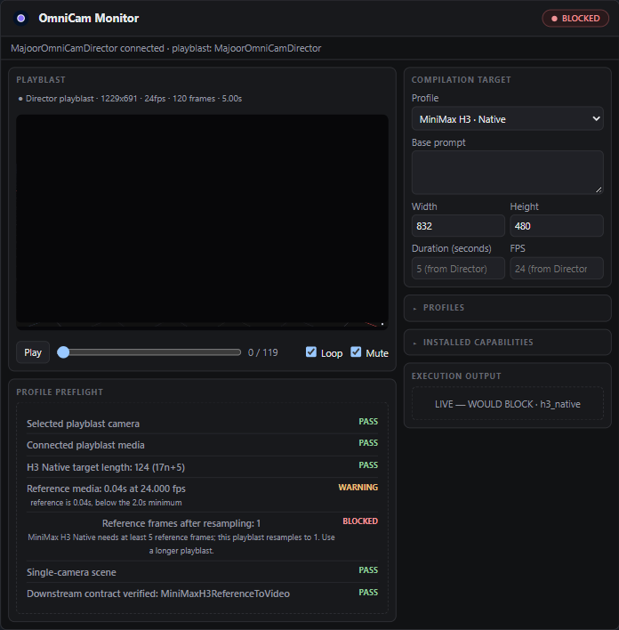

# OmniCam — node guide

This document describes only the nodes OmniCam actually registers
(`omnicam/node_registry.py`): **three product nodes**. The unpublished
compatibility nodes, Sequencer and DCC exporters are not part of the public
registry; their history remains in git.

| Node id | Display name | Category | State |
|---|---|---|---|
| `MajoorOmniCamDirector` | OmniCam Director | `Majoor/OmniCam` | product |
| `MajoorOmniCamExtractor` | OmniCam Extractor | `Majoor/OmniCam` | product |
| `MajoorOmniCamMonitor` | OmniCam Monitor | `Majoor/OmniCam` | product |

## Canonical flow

```text
OmniCam Extractor → OmniCam Director → OMNICAM_MOTION_SCENE → OmniCam Monitor → native model artifact
   recover              author                                  preflight / compile
```

The motion scene is the source of truth. It contains model-independent cameras,
objects, screen tracks, projected anchors and cuts. Model-specific frame grids,
prompt dialects and transport formats belong to Monitor profiles and never leak
into the Director scene.

## Media sockets: VIDEO or IMAGE

Every OmniCam input socket that carries footage — the Director's `image` and `video`,
the Extractor's `video`, the Monitor's `proxy_video` — is a multi-type
`VIDEO,IMAGE` socket, so a generator's `IMAGE` batch connects without an
`ImageToVideo` node in between. The conversion happens at the node boundary
(`omnicam/nodes/media.py`):

| Connected | Wanted | What OmniCam does |
|---|---|---|
| `IMAGE` | video | wraps the batch in memory, read at the node's fps (24 if it has none) |
| `VIDEO` | images | bounded sampling, never a full decode |
| `IMAGE` | a solvable source | encodes it below `temp/omnicam/extractor_runtime/` first, because a solve seeks inside its source |

### Video outputs and bounded IMAGE conversion

The Director keeps its playblast as `VIDEO`; it does not decode or duplicate
frames during authoring execution. Monitor performs bounded conversion only for
profiles that require `IMAGE` frames. Monitor exposes `reference_frames` only
for profiles such as H3 Native that consume an IMAGE batch.

---

## OmniCam Director — `MajoorOmniCamDirector`

Interactive camera-layout, motion-track, animation, timeline and playblast
environment. Execution compiles the complete editor state to a strict,
model-independent MotionScene.



*Regenerate the screenshots against a running ComfyUI (real Director/Extractor/Monitor wiring, a real live preflight):*
```text
OMNICAM_LIVE_URL=http://127.0.0.1:8188 OMNICAM_LIVE_MATCH=live-docs-screens.spec.js \
  OMNICAM_LIVE_VIDEO=<a clip in ComfyUI/input> npm run test:live
```
*then copy `test-results/live-*.png` into `docs/assets/`. `npx playwright test tests/frontend/docs-screens.spec.js` regenerates the Director outliner/inspector close-ups from an isolated module mount instead, with no server required.*

**Inputs.** `width`, `height`, `fps`, `duration_seconds`, `render_mode`
(`omni_ref`, `graybox`, `grid`, `point_field`, `wireframe`, `card_grid`,
`beauty`), optional `image` / `video` (either media type) and `audio`, an
optional `scene_3d`, and an optional upstream `solved_scene` (an OmniCam
Extractor connects here). `state_json`, `recording_path` and `card_asset` are
advanced fields the interface manages.

**Outputs**, in schema order:

| Output | Type | Meaning |
|---|---|---|
| `motion_scene` | `OMNICAM_MOTION_SCENE` | cameras, objects, motion layers, cuts and authoring timeline |
| `playblast_video` | `VIDEO` | the recorded model-control playblast, or the connected clip |
| `audio` | `AUDIO` | associated audio |

The Director does not emit camera-only, shot-collection or decoded-frame
compatibility outputs. Cuts and all authored cameras remain inside MotionScene;
the playblast stays a single first-class conditioning artifact.

### Playblast contract

Both WebCodecs and MediaRecorder capture exactly `duration_frames` at the
authored fps and current playblast resolution. Capture mode suppresses
selection outlines, gizmos, Motion Track overlays and other editor chrome while
retaining intentional scene content such as cards, graybox objects and grids.

After a successful managed upload, `MotionScene.metadata.playblast` records the
encoder, MIME type, fps, frame count, exact duration, dimensions, aspect ratio,
timing drift, clean-capture flag and resolved edit cuts. Monitor also inspects
the connected ComfyUI `VIDEO` through `get_dimensions`, `get_frame_rate`,
`get_frame_count` and `get_duration`; file-backed videos provide these facts
without decoding their image tensors.

**Interface density.** The `View → Interface` selector (Basic / Animation /
Advanced) is progressive disclosure of one layout, not three layouts. The full
authoring overview is in [USER_GUIDE.md](USER_GUIDE.md); keyboard and viewport
controls are in [SHORTCUTS.md](SHORTCUTS.md).

### Motion Tracks

The Camera View toolbar provides `Select`, `Track`, `Anchor`, `Project` and
`Erase`. Track draws a sparse normalized screen path over the current playback
range; Anchor creates a held screen point; Project binds a point to the selected
object or a world point. Camera Field presets add Balanced, Foreground, Subject,
Ground Parallax or Depth Layers sources.

Motion layers appear in the Outliner and as aligned timeline rows. Their keys
support linear, smooth and hold interpolation, explicit visibility and retiming
to the playback range. The authored layers serialize in `state_json` and compile
into `OMNICAM_MOTION_SCENE`. Their editor overlay is excluded from playblast
capture.

### Upstream `solved_scene` import

The Director's optional `solved_scene` input selects the scene's playblast
camera and imports it by fingerprint
(`extractor_fingerprint`):

- no cable → the Director's local state;
- fingerprint already imported → the local state, **including your edits**;
- unknown fingerprint → the upstream camera motion, re-hosted in the Director's
  scene and render context.

Resolution, render mode, objects, constraints and scene metadata always stay
with the Director. Disconnect the cable to freeze the imported trajectory.

The input is called `solved_scene` rather than `motion_scene` because only
that one camera is imported: motion layers, objects, cuts and other cameras
on the upstream scene are not merged.

---

## OmniCam Extractor — `MajoorOmniCamExtractor`



Estimates a **relative** 6DoF camera trajectory from one continuous video shot
and wraps that internal camera solve in a canonical one-camera MotionScene.

**Inputs.**

| Input | Default | Role |
|---|---|---|
| `video` | — | one continuous shot, `VIDEO` or `IMAGE` batch; a hard cut is reported, never stitched |
| `method` | `dpvo` | `dpvo`; `auto` prefers DPVO, then pycolmap, then OpenCV/SIFT, taking the first installed; `pycolmap` or `opencv_sift` force those directly |
| `lens_mode` | `auto` | `auto`, `fov` or `focal_mm` |
| `fov_degrees` | `53.0` | vertical FOV, used when `lens_mode=fov` |
| `focal_length_mm` | `24.0` | focal length, used when `lens_mode=focal_mm` |
| `sensor_width_mm` | `36.0` | sensor width, used when `lens_mode=focal_mm` |
| `max_dimension` | `840` | solver long edge; never upscales |
| `frame_step` | `1` | sampling stride; keys keep the **source** frame numbers |
| `normalize_origin` | `True` | places frame 0 at the origin with identity orientation |
| `motion_scale` | `1.0` | sizes the relative translation for your scene; never touches rotation |
| `position_smoothing` | `0.15` | centred, so it adds no temporal lag; `0` = raw solve |
| `rotation_smoothing` | `0.10` | weighted quaternion mean after sign-continuity |
| `simplify_keys` | `True` | key reduction that accounts for position **and** orientation |
| `position_tolerance` | `0.01` | allowed position error; `0` = lossless |
| `rotation_tolerance_deg` | `0.25` | allowed angular error; `0` = lossless |

**Outputs.** `motion_scene` (canonical `OMNICAM_MOTION_SCENE` with one extracted
camera), `solver_coverage` (the share of sampled frames that produced a pose — not a
physical accuracy), and `report` (human-readable: backend, keys, lens, warnings).

The solver and refinement stages still operate on the internal schema-v1
`OmniCamTrack`; only the node boundary exposes MotionScene.

**V1 limits.** No metric scale, no animated zoom, no lens distortion, no
rolling shutter, no multi-shot solve, no object or body capture.

### Interactive solve panel

The node carries a matchmove panel. `▶ TRACK` starts the solve immediately and
**does not queue a ComfyUI prompt** — no graph run, no model loaded. Four
transport controls:

```text
▶ TRACK     start solving now
■ STOP      abandon it, keeping the partial path for review
```

Job states:

```text
IDLE → PREPARING → TRACKING → SOLVING → REFINING → COMPLETED
any active state → STOPPING → STOPPED
any active state → FAILED
```

Stop is cooperative: the solver is asked between safe frames, and the panel
reports `STOPPING` until the worker reaches one. No thread is killed and no CUDA
context is force-destroyed. Pause/Resume is intentionally absent because native
GPU backends cannot guarantee it safely. A `STOPPED` or `FAILED` solve never
produces a final track and `APPLY REFINED` stays disabled.

While it runs the panel shows two tabs:

| Tab | Shows |
|---|---|
| `VIDEO` | the managed footage the solver reads, with live solver points overlaid as it tracks |
| `TRACK 3D` | the solved trajectory, read-only: orbit / pan / zoom, Fit, Top/Front/Side |

OpenCV streams a bounded transient 3D path while it tracks. DPVO reports honest
source-frame progress but publishes its trajectory only after global
optimisation completes; it does not fabricate intermediate poses. Once frame
ingest completes, the panel changes from `TRACKING` to `SOLVING` while DPVO
finalizes. That finalization has a separate 120-second watchdog: a stalled
global optimization fails with guidance to shorten the clip, lower
`max_dimension`, or select `opencv_sift`.

### Sources accepted without Run

| Source | Interactive |
|---|---|
| a connected native `Load Video` | yes |
| a file chosen through `Choose Video` | yes |
| an in-memory `VIDEO` / `IMAGE` batch, before its first execution | no — the reason is shown |
| a runtime `VIDEO` after a normal Extractor execution | yes — via a managed `[temp]` copy |
| an unknown third-party `VIDEO` node, after the Extractor materialises it | yes — via a `[temp]` reference |

Third-party widget names are never guessed. The panel never silently queues the
graph. During a normal execution, a source that is not already a managed file
is encoded below `temp/omnicam/extractor_runtime/` with a UUID name; the UI
envelope carries only the annotated reference, never an absolute path.

### No-run routes

```text
POST   /majoor/omnicam/extractor/source
POST   /majoor/omnicam/extractor/frame
POST   /majoor/omnicam/extractor/jobs
GET    /majoor/omnicam/extractor/jobs/{job_id}
POST   /majoor/omnicam/extractor/jobs/{job_id}/pause
POST   /majoor/omnicam/extractor/jobs/{job_id}/resume
POST   /majoor/omnicam/extractor/jobs/{job_id}/stop
POST   /majoor/omnicam/extractor/jobs/{job_id}/refine
GET    /majoor/omnicam/extractor/jobs/{job_id}/result
DELETE /majoor/omnicam/extractor/jobs/{job_id}
POST   /majoor/omnicam/upload_extractor_source
```

`/extractor/source` measures a source without starting anything: the panel
needs the frame rate and count before the first solve, or its scrubber has no
range. WebSocket events
`majoor.omnicam.extractor.{job,progress,pose,quality,features,completed,failed}`
are rate-limited to ~10 Hz **per channel**. The WebSocket is transport, not
state: `GET /jobs/{id}` stays the source of truth after a disconnect.

`/extractor/frame` is a read-only, managed-source JPEG preview route. The
panel uses native browser video first; only an unsupported or undecodable
container switches to this per-frame fallback, so the source scrubber remains
usable without changing what the solver reads.

### Track timeline and inspection

The read-only timeline has four visible rows: **Solve Health**, **Camera**,
**Look At**, and **Roll**. Camera, Look At, and Roll show a diamond only when
that channel changes; FOV remains in the canonical camera data and Current
Frame details, but is not a timeline lane. Solve Health combines tracker
quality (coverage and inliers) with the motion grade: each rendered pixel uses
the worse state, shown as green, orange, red, or grey when unknown. Clicking an
anomaly jumps the shared source/video/3D frame clock to that frame.

The Current Frame diagnostics distinguish **Solve state** from **Motion grade**
and show only measured values: coverage, inliers, speed, angular speed,
acceleration, jerk, and framing loss where available. Anomalies use structured
severity (`WARN` or `ERROR`), the observed metric, a recommended compatible
refinement action, and inclusive `start_frame`/`end_frame` ranges. Adjacent
failures of one kind are shown as one review range; choosing an action applies
it across that range without mutating the raw solve.

The 3D tab has two read-only inspection modes. **SCENE** uses orbit controls to
inspect the recovered path and current frustum. **CAMERA** renders the solved
pose and FOV at the selected source frame; scene-orbit preset controls are
disabled there. When a DPVO build exposes compatible map geometry, the finished
job may include a bounded optional landmark cloud (at most 8,000 finite points).
Its absence never affects a completed solve.

The timeline edits nothing: the Extractor corrects through Refine, and a second
editable timeline would silently disagree with the first.

### Non-destructive refinement

The raw solve is **immutable**. Every control re-derives a track from it, with
no video decode and no solver:

```text
raw → spike actions → trim → origin → global alignment
    → scale → quaternion continuity → smoothing → key reduction → track
```

Alignment is **global**: one pitch/yaw/roll offset for the whole solve, never
per key. Spike detection uses median and MAD, so a camera that is simply moving
fast is not flagged. `RESET` returns to the raw solve exactly.

`APPLY REFINED` writes the result into the node's serialized state and notifies
the connected Director. Changing a control afterwards marks the result
`OUTDATED` until the next apply; the Director is never overwritten while you
experiment.

### Backends

DPVO ([princeton-vl/DPVO](https://github.com/princeton-vl/DPVO), MIT), pycolmap
([colmap/pycolmap](https://github.com/colmap/pycolmap), BSD-3-Clause) and
OpenCV/SIFT are all **optional** and lazily imported: OmniCam loads normally
with none of them. `auto` tries them in that order and takes the first one
installed. The DPVO checkpoint is read from one fixed, non-configurable
managed path:

```text
ComfyUI/models/omnicam/dpvo/dpvo.pth
```

OmniCam never runs `pip install` at runtime. No third-party solver code or
configuration is redistributed in this package. Each DPVO solve runs in a
fresh spawned process; sampled frames cross through a private NumPy memmap
below ComfyUI's temp directory, removed on success, stop and failure. When the
child exits its CUDA context exits with it, so DPVO VRAM returns to the driver
instead of staying in ComfyUI's allocator. Frame memmap views are copied into
writable contiguous arrays before Torch consumes them. See
[Installing DPVO](TECHNICAL_REFERENCE.md#installing-dpvo) for the Windows
build procedure, and [TECHNICAL_REFERENCE.md](TECHNICAL_REFERENCE.md) for the
runtime notes.

pycolmap runs incremental Structure-from-Motion rather than DPVO/OpenCV's
frame-to-frame visual odometry: it extracts and matches features globally,
then registers frames one at a time against a shared point cloud with bundle
adjustment. That is more expensive per frame, but it does not zero out
translation on a low-parallax or rotation-only segment the way essential-matrix
VO does -- see OpenCV/SIFT's own module docstring for that limitation. A hard
cut in the footage can come back as more than one disconnected reconstruction;
only the largest is used, and it is reported as a warning rather than silently
bridged. Unlike DPVO, `pip install pycolmap` is the entire installation: it
ships prebuilt Windows wheels with no CUDA extension to compile.

---

## OmniCam Monitor — `MajoorOmniCamMonitor`



The model compiler, and the single exit point from OmniCam into the rest of the
graph. Monitor takes a MotionScene and its playblast, resolves the timeline the
selected profile requires, compiles the scene into that model's representation,
and reports what survived.

The watcher follows the **sockets**, not the upstream node class: any source of
`OMNICAM_MOTION_SCENE` is accepted — Director, Extractor or a third-party node.

**Inputs.**

| Input | Default | Role |
|---|---|---|
| `motion_scene` | — | the canonical scene to compile |
| `playblast_video` | optional | the shot the scene describes, `VIDEO` or `IMAGE` batch |
| `base_prompt` | empty | user intent, kept at the head of `final_prompt` |
| `target_profile` | `external_reference_video` | one of the eight profiles below |
| `target_width`, `target_height` | `832`, `480` | target frame size |
| `duration_seconds`, `target_fps` | `0` (auto), `0` (auto) | length and frame rate of the shot being compiled; `0` inherits `timeline.duration_seconds` / `timeline.authoring_fps` from the connected MotionScene (the Director's authored shot) |

**Outputs**, in schema order: `final_prompt`, `reference_video`,
`reference_frames`, `camera_embedding`, `native_tracks`, `tracks_json`,
`target_width`, `target_height`, `target_length`.

Only the selected profile's outputs are computed; the rest are `None`. Which one
carries the payload is decided by the profile's **semantic**, not by its model.

### The eight profiles, by semantic

`external_reference_video` is the only permissive one: no upstream node
requirement, no frame grid, no fps conversion, and it never blocks on a missing
or unrecognized downstream. Every other profile is strict -- it encodes one
real model's contract, and a payload that contract cannot satisfy stops the
queue rather than reaching the model broken.

| Profile | Semantic | Output | Downstream |
|---|---|---|---|
| `external_reference_video` | `reference_video` | `reference_video` + `final_prompt` | any destination model's own reference-video input; no contract enforced |
| `wan_camera_native` | `camera_embedding` | `camera_embedding` | `WanCameraImageToVideo.camera_conditions`; real extrinsics and intrinsics, the highest-fidelity path; length 4n+1 |
| `wan_move_native` | `screen_tracks` | `native_tracks` | `WanMoveTrackToVideo.tracks`; `comfy_api.latest.io.Tracks`, i.e. `track_path` `[frames, tracks, 2]` and `track_visibility` `[frames, tracks]` |
| `wan_track_native` | `screen_tracks` | `tracks_json` | `WanTrackToVideo.tracks`; a 121-sample source grid resampled upstream to the generation length |
| `wanvideo_ati` | `screen_tracks` | `tracks_json` | `WanVideoATITracks.tracks` (WanVideoWrapper); fixed 121 samples |
| `ltx25_motion_track` | `screen_tracks` | `tracks_json` | `LTXVDrawTracks.tracks`, then IC-LoRA Motion Track; length 8n+1 |
| `h3_native` | `reference_video` | `reference_frames` + `final_prompt` | `MiniMaxH3ReferenceToVideo.ref_videos`; resampled to 24 fps, length 17n+5 |
| `h3_api` | `reference_video` | `reference_video` + `final_prompt` | `MinimaxHailuo03ReferenceNode.reference_video` |

### Timeline resolution

Trajectories are sampled on the shot's real frame times, `[0, (n-1)/fps]`, not
across its playing duration `[0, n/fps]`. A 5-frame shot at 5 fps runs
0, 0.2, 0.4, 0.6, 0.8 s — the last frame is at 0.8 s, not 1.0 s. Sampling across
the duration instead stretches every track by one frame, and a key authored
exactly at the end of the timeline lands one frame past the final image and is
never displayed, the same as in any NLE.

Profiles that pad to a fixed grid (ATI's 121 samples) or round the length up
(LTX, H3) still sample the *source shot's* span, so every generated frame lands
exactly on a grid sample.

### Preflight

Preflight is binding. Anything `BLOCKED` stops compilation rather than colouring
a panel. Four kinds of check, deliberately separate:

1. **Scene requirements** — a playblast camera that exists and is enabled, at
   least one enabled motion layer, a connected playblast where one is needed.
2. **The multi-shot gate** — a MotionScene can describe an edit. Profiles with
   `camera_embedding` or `screen_tracks` semantics carry one camera basis and
   are `BLOCKED` on an edit that cuts to a second camera, because the output
   would be wrong from the first cut and wrong *silently*. `reference_video`
   profiles accept it: the playblast already contains the cuts frame for frame.
   Their camera prompt is replaced by a neutral one, since no single trajectory
   describes the edit and a prompt claiming otherwise contradicts the video.
3. **Track encodability** — the JSON track formats mark every supplied point
   visible and zero-pad the tail, so they cannot express "appears later" or
   "disappears and returns". A layer hidden on the first sample is dropped; one
   with a visibility gap is cut there. Monitor names the affected layers instead
   of encoding less than you authored. Nothing encodable at all is `BLOCKED`.
4. **The downstream contract** — the capability registry checks the node the
   selected profile targets. `missing` and `incompatible` are `BLOCKED`,
   `detected_unverified` is a `WARNING`, `verified` passes. Only the selected
   profile is binding: a missing LTX install never blocks a Wan Camera compile.
   Outside a running ComfyUI there are no node mappings to read, and no check is
   emitted rather than a false failure.

Capability contracts are keyed by profile id — the same seven names used by the
backend, the routes, the frontend and the tests. Each is pinned to an upstream
ref and commit in `omnicam/adapters/registry.py`, and
`tests/fixtures/upstream_contracts/` records the exact source literals the
contract depends on, verified against the installed ComfyUI by
`tests/test_upstream_contract_fixtures.py`.

## Camera interchange

Export to `.glb` / `.gltf`, `.usda` and `.chan`; import from `.gltf`, `.glb`,
`.fbx`, `.chan` and OmniCam / Blender JSON. Written files land under
`output/omnicam/exports/`. Everything is baked one sample per frame:
OmniCam's ease / smooth / bezier / hold interpolation has no equivalent in
these formats, so writing only the keys would change the received curve. glTF
also carries the canonical track in `extras.omnicam`, which makes the round trip
back into OmniCam lossless. OBJ is not offered (no camera, no time, no FOV).
FBX is read but not written — export goes through glTF or USD, which reach the
same applications.

## Capabilities and compatibility

`ADAPTER_INFO` is the single registry. Runtime states: `missing`,
`detected_unverified`, `verified`, `incompatible`. Verification inspects the
sockets the installed classes expose; class presence alone never announces a
pinned version or a verified integration.

OmniCam uses `comfy_api.latest` because the required V3 contract (`IO.Schema`,
`IO.Video`, `IO.WanCameraEmbedding`, Node Replacement) is not fully provided by
the stable `v0_0_2` adapter. The declared and tested minimum is ComfyUI
`0.31.0`, which bundles `comfyui-frontend-package==1.48.7`; both bounds in
`pyproject.toml` agree. CI blocks on `v0.31.0` and `v0.34.0`; `master` is a
non-blocking canary. A separate weekly, non-blocking contract canary checks the
current LTX-Video and WanVideoWrapper sources against the pinned adapter socket
contracts. It reports drift for review and never expands declared support.

### Compatibility deprecations

Monitor outputs are not reordered or removed in 0.1.x. A future major may
deprecate `camera_prompt`, `cinematic_prompt`, `camera_data_json`, and
`adapter_profile_json`; saved links remain stable until a versioned slot
migration exists. Scene-aware trajectory anchors (depth, mesh, tracked points)
are explicitly deferred until after 1.0; the stable core continues to project
model-agnostic synthetic anchors.

## Non-public components

- Scene motion analysis: geometry-derived projected-centre data, not real pixel
  passes.
- `omnicam/core/camera_tools.py`: an internal library the adapters call,
  exposed by no node.

### OmniCam → LTX 2.5 Motion Track

Projected 2D trajectories consumed by LTXVDrawTracks and the IC-LoRA Motion Track.
The length must satisfy the 8n+1 frame rule.
