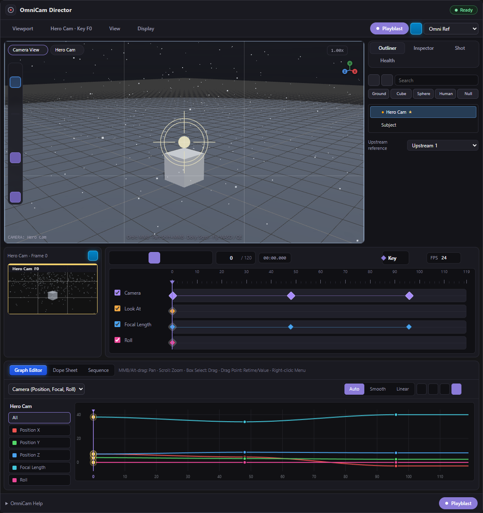

# OmniCam — node guide

This document describes only the nodes OmniCam actually registers
(`omnicam/node_registry.py`): **three product nodes** and **four deprecated
compatibility nodes**. The Sequencer, the scene-motion analysis helpers and the
DCC exporters are removed from the shipped package; their history is in git.

| Node id | Display name | Category | State |
|---|---|---|---|
| `MajoorOmniCamDirector` | OmniCam Director | `Majoor/OmniCam` | product |
| `MajoorOmniCamExtractor` | OmniCam Extractor | `Majoor/OmniCam` | product |
| `MajoorOmniCamMonitor` | OmniCam Monitor | `Majoor/OmniCam` | product |
| `MajoorOmniCamH3Adapter` | OmniCam → Universal Reference & AI Prompts | `Majoor/OmniCam/Legacy` | deprecated |
| `MajoorOmniCamWanNativeCamera` | OmniCam → Wan Native Camera | `Majoor/OmniCam/Legacy` | deprecated |
| `MajoorOmniCamLTXCameraGuide` | OmniCam → LTX Camera Guide | `Majoor/OmniCam/Legacy` | deprecated |
| `MajoorOmniCamWanVideoWrapperATI` | OmniCam → WanVideoWrapper ATI | `Majoor/OmniCam/Legacy` | deprecated |

## Canonical flow

```text
OmniCam Extractor → OmniCam Director → MAJOOR_OMNICAM_TRACK → OmniCam Monitor → model adapter
   recover              author                                 QC / preflight / route
```

The track is the source of truth. Adapters never read the viewport's internal
state directly. Model-specific behaviour lives behind Monitor's adapter
selection and never leaks into the canonical track.

## Media sockets: VIDEO or IMAGE

Every OmniCam socket that carries footage — the Director's `image` and `video`,
the Extractor's `video`, the Monitor's `proxy_video` — is a multi-type
`VIDEO,IMAGE` socket, so a generator's `IMAGE` batch connects without an
`ImageToVideo` node in between. The conversion happens at the node boundary
(`omnicam/nodes/media.py`):

| Connected | Wanted | What OmniCam does |
|---|---|---|
| `IMAGE` | video | wraps the batch in memory, read at the node's fps (24 if it has none) |
| `VIDEO` | images | bounded sampling, never a full decode |
| `IMAGE` | a solvable source | encodes it below `temp/omnicam/extractor_runtime/` first, because a solve seeks inside its source |

### Video outputs carry an IMAGE twin

An output returns exactly one concrete value, and ComfyUI has no "VIDEO or
IMAGE" output type, so every socket that outputs a proxy or reference video
carries a second plain `IMAGE` output beside it: `proxy_frames` on the Director,
`reference_frames` on the Monitor and on the deprecated H3 node. Each twin is a
bounded uniform sample — never a full decode — and degrades to `None` rather
than aborting the node. Wire whichever output your downstream node wants;
nothing needs both.

---

## OmniCam Director — `MajoorOmniCamDirector`

Interactive camera-layout, animation, timeline and playblast environment. The
frontend stores a canonical camera track and an optional proxy playblast;
execution exposes both to the graph.



*Regenerate the screenshots with `npx playwright test tests/frontend/docs-screens.spec.js`, then copy `test-results/docs-*.png` into `docs/assets/`.*

**Inputs.** `width`, `height`, `fps`, `duration_seconds`, `render_mode`
(`omni_ref`, `graybox`, `grid`, `point_field`, `wireframe`, `card_grid`,
`beauty`), optional `image` / `video` (either media type) and `audio`, an
optional `scene_3d`, and an optional upstream `camera_track` (an OmniCam
Extractor connects here). `state_json`, `recording_path` and `card_asset` are
advanced fields the interface manages.

**Outputs**, in schema order:

| Output | Type | Meaning |
|---|---|---|
| `camera_track` | `MAJOOR_OMNICAM_TRACK` | canonical track of the active camera — the one public contract |
| `proxy_video` | `VIDEO` | the recorded playblast, or the connected clip |
| `audio` | `AUDIO` | associated audio |
| `shot_collection` | `MAJOOR_OMNICAM_SHOT_COLLECTION` | every authored camera and its proxy, with a per-camera `proxy_ready` flag |
| `proxy_frames` | `IMAGE` | bounded IMAGE twin of `proxy_video`; `None` when there is no proxy |

The Director no longer emits `camera_info`, `track_json`, `sequence`,
`shots_json` or `director_shot`. For a video preview it reads container
metadata, then decodes at most 32 uniform frames through bounded
`VIDEO.as_trimmed()` ranges.

**Interface density.** The `View → Interface` selector (Basic / Animation /
Advanced) is progressive disclosure of one layout, not three layouts. The full
table is in the project README under *Interface density: Basic, Animation,
Advanced*.

### Upstream `camera_track` import

The Director's optional `camera_track` input is imported by fingerprint
(`extractor_fingerprint`):

- no cable → the Director's local state;
- fingerprint already imported → the local state, **including your edits**;
- unknown fingerprint → the upstream camera motion, re-hosted in the Director's
  scene and render context.

Resolution, render mode, objects, constraints and scene metadata always stay
with the Director. Disconnect the cable to freeze the imported trajectory.

---

## OmniCam Extractor — `MajoorOmniCamExtractor`

Estimates a **relative** 6DoF camera trajectory from one continuous video shot
and emits a canonical schema-v1 track.

**Inputs.**

| Input | Default | Role |
|---|---|---|
| `video` | — | one continuous shot, `VIDEO` or `IMAGE` batch; a hard cut is reported, never stitched |
| `method` | `dpvo` | `dpvo`; `auto` prefers DPVO when installed and falls back to OpenCV/SIFT; `opencv_sift` forces the classical solver |
| `lens_mode` | `auto` | `auto`, `fov` or `focal_mm` |
| `fov_degrees` | `53.0` | vertical FOV, used when `lens_mode=fov` |
| `focal_length_mm` | `24.0` | focal length, used when `lens_mode=focal_mm` |
| `sensor_width_mm` | `36.0` | sensor width, used when `lens_mode=focal_mm` |
| `max_dimension` | `640` | solver long edge; never upscales |
| `frame_step` | `1` | sampling stride; keys keep the **source** frame numbers |
| `normalize_origin` | `True` | places frame 0 at the origin with identity orientation |
| `motion_scale` | `1.0` | sizes the relative translation for your scene; never touches rotation |
| `position_smoothing` | `0.15` | centred, so it adds no temporal lag; `0` = raw solve |
| `rotation_smoothing` | `0.10` | weighted quaternion mean after sign-continuity |
| `simplify_keys` | `True` | key reduction that accounts for position **and** orientation |
| `position_tolerance` | `0.01` | allowed position error; `0` = lossless |
| `rotation_tolerance_deg` | `0.25` | allowed angular error; `0` = lossless |

**Outputs.** `camera_track` (canonical `MAJOOR_OMNICAM_TRACK`), `confidence`
(**solver coverage**, the share of sampled frames that produced a pose — not a
physical accuracy), `report` (human-readable: backend, keys, lens, warnings).

`confidence` remains at its historical slot in 0.x as a legacy alias for the
canonical `solver_coverage` metadata field. The UI labels it **Solver Coverage**.

**V1 limits.** No metric scale, no animated zoom, no lens distortion, no
rolling shutter, no multi-shot solve, no object or body capture.

### Interactive solve panel

The node carries a matchmove panel. `▶ TRACK` starts the solve immediately and
**does not queue a ComfyUI prompt** — no graph run, no model loaded. Four
transport controls:

```text
▶ TRACK     start solving now
■ STOP      abandon it, keeping the partial path for review
```

Job states:

```text
IDLE → PREPARING → TRACKING → SOLVING → REFINING → COMPLETED
any active state → STOPPING → STOPPED
any active state → FAILED
```

Stop is cooperative: the solver is asked between safe frames, and the panel
reports `STOPPING` until the worker reaches one. No thread is killed and no CUDA
context is force-destroyed. Pause/Resume is intentionally absent because native
GPU backends cannot guarantee it safely. A `STOPPED` or `FAILED` solve never
produces a final track and `APPLY REFINED` stays disabled.

While it runs the panel shows three tabs:

| Tab | Shows |
|---|---|
| `SOURCE` | the clean managed footage the solver reads |
| `TRACK 3D` | the solved trajectory, read-only: orbit / pan / zoom, Fit, Top/Front/Side |
| `COMPARE` | clean source, the same frame with live solver points, and the read-only 3D track, side by side |

OpenCV streams a bounded transient 3D path while it tracks. DPVO reports honest
source-frame progress but publishes its trajectory only after global
optimisation completes; it does not fabricate intermediate poses.

### Sources accepted without Run

| Source | Interactive |
|---|---|
| a connected native `Load Video` | yes |
| a file chosen through `Choose Video` | yes |
| an in-memory `VIDEO` / `IMAGE` batch, before its first execution | no — the reason is shown |
| a runtime `VIDEO` after a normal Extractor execution | yes — via a managed `[temp]` copy |
| an unknown third-party `VIDEO` node, after the Extractor materialises it | yes — via a `[temp]` reference |

Third-party widget names are never guessed. The panel never silently queues the
graph. During a normal execution, a source that is not already a managed file
is encoded below `temp/omnicam/extractor_runtime/` with a UUID name; the UI
envelope carries only the annotated reference, never an absolute path.

### No-run routes

```text
POST   /majoor/omnicam/extractor/source
POST   /majoor/omnicam/extractor/jobs
GET    /majoor/omnicam/extractor/jobs/{job_id}
POST   /majoor/omnicam/extractor/jobs/{job_id}/pause
POST   /majoor/omnicam/extractor/jobs/{job_id}/resume
POST   /majoor/omnicam/extractor/jobs/{job_id}/stop
POST   /majoor/omnicam/extractor/jobs/{job_id}/refine
GET    /majoor/omnicam/extractor/jobs/{job_id}/result
DELETE /majoor/omnicam/extractor/jobs/{job_id}
POST   /majoor/omnicam/upload_extractor_source
```

`/extractor/source` measures a source without starting anything: the panel
needs the frame rate and count before the first solve, or its scrubber has no
range. WebSocket events
`majoor.omnicam.extractor.{job,progress,pose,quality,features,completed,failed}`
are rate-limited to ~10 Hz **per channel**. The WebSocket is transport, not
state: `GET /jobs/{id}` stays the source of truth after a disconnect.

### Track timeline

Below the solve, the panel draws the channels the solve produced — Camera,
Look At, Focal Length, Roll — as diamonds on the video's frame axis. A key sits
only where **its** channel changes. Two bands sit above it:

- **SOLVE** — tracker health (coverage, inliers): could it *see*?
- **MOTION** — `motion_health`, the same grading as the Director's Health
  panel, against the selected adapter's limits: is the recovered camera
  *shootable*?

A green SOLVE with a red MOTION is a real case — a clean track of a camera too
fast for the target model — and is exactly what one merged bar would hide. The
MOTION band follows RAW / REFINED. The timeline edits nothing: the Extractor
corrects through Refine, and a second editable timeline would silently disagree
with the first.

### Non-destructive refinement

The raw solve is **immutable**. Every control re-derives a track from it, with
no video decode and no solver:

```text
raw → spike actions → trim → origin → global alignment
    → scale → quaternion continuity → smoothing → key reduction → track
```

Alignment is **global**: one pitch/yaw/roll offset for the whole solve, never
per key. Spike detection uses median and MAD, so a camera that is simply moving
fast is not flagged. `RESET` returns to the raw solve exactly.

`APPLY REFINED` writes the result into the node's serialized state and notifies
the connected Director. Changing a control afterwards marks the result
`OUTDATED` until the next apply; the Director is never overwritten while you
experiment.

### Backends

DPVO ([princeton-vl/DPVO](https://github.com/princeton-vl/DPVO), MIT) and
OpenCV/SIFT are **optional** and lazily imported: OmniCam loads normally with
neither. The DPVO checkpoint is read from one fixed, non-configurable managed
path:

```text
ComfyUI/models/omnicam/dpvo/dpvo.pth
```

OmniCam never runs `pip install` at runtime. No DPVO code or configuration is
redistributed in this package. Each DPVO solve runs in a fresh spawned process;
sampled frames cross through a private NumPy memmap below ComfyUI's temp
directory, removed on success, stop and failure. When the child exits its CUDA
context exits with it, so DPVO VRAM returns to the driver instead of staying in
ComfyUI's allocator. See the README for the Windows-portable build notes.

---

## OmniCam Monitor — `MajoorOmniCamMonitor`


The QC, preflight and delivery stage for the canonical track, and the single
exit point from OmniCam into the rest of the graph. Monitor watches the
Director without running the graph: an upstream change moves the state to
`OUTDATED`, then Live Sync calls the bounded
`POST /majoor/omnicam/monitor/snapshot` route after 250 ms; Refresh calls the
same route. Neither loads a model, builds `WAN_CAMERA_EMBEDDING` or
materialises the LTX IMAGE batch.

The watcher follows the **sockets**, not the upstream node class. Any source of
`MAJOOR_OMNICAM_TRACK` is accepted — Director, Extractor or a third-party node.
A source that does not expose its track in a widget (Extractor) is `CONNECTED`,
not `OFFLINE`. Proxy availability follows the `proxy_video` socket;
`recording_path` is just the Director playblast special case.

**Inputs.**

| Input | Default | Role |
|---|---|---|
| `camera_track` | — | canonical track |
| `proxy_video` | optional | the shot the track describes, `VIDEO` or `IMAGE` batch |
| `adapter` | `h3` | `h3`, `h3_native`, `wan_native`, `wan_ati`, `wan_tracks_native`, `ltx_motion_track`, `ltx` |
| `base_prompt` | empty | user intent kept in the final prompt |
| `video_ref_token` | `auto` | deprecated; the H3 dialect is inferred from the installed node, hidden in the UI |
| `width`, `height`, `length` | `832`, `480`, `81` | adapter dimensions and length |
| `point_count`, `distribution` | `16`, `balanced` | ATI trajectory projection |
| `ltx_max_frames`, `ltx_sampling_mode` | `121`, `contiguous` | bounded legacy LTX sampling plan |

**Outputs**, in schema order: `reference_video`, `camera_prompt`,
`cinematic_prompt`, `final_prompt`, `camera_data_json`, `wan_camera`, `tracks`,
`adapter_width`, `adapter_height`, `adapter_length`, `guide_frames`,
`adapter_profile_json`, `reference_frames` (bounded IMAGE twin of
`reference_video`). Only the selected adapter's outputs are computed; inactive
heavy outputs are `None`.

The preview reuses the real proxy for `h3`. ATI, Wan tracks and LTX Motion
Track show the exact delivered coordinates. Legacy LTX shows the exact sampling
indices. Wan Camera shows only a camera path marked **DIAGNOSTIC**, because the
final embedding only exists after node execution.

The global setup diagnostic distinguishes core readiness from optional adapter
issues. An incompatible adapter that is not selected is a warning and does not
make the model-agnostic core unhealthy. The selected adapter is checked again
by Monitor preflight; any incompatible required stage or socket contract is
blocking for that workflow.

### The seven adapters, by family

| Adapter | Family | Control path |
|---|---|---|
| `h3` | video reference | reference video + prompt, `Video 1` dialect (`MinimaxHailuo03ReferenceNode`) |
| `h3_native` | video reference | supplied reference resampled to 24 FPS as IMAGE frames + prompt, `<Video 1>` dialect (`MiniMaxH3ReferenceToVideo`); decoding is capped at the aligned generation length, not at an arbitrary duration |
| `wan_native` | camera conditioning | a true digital camera: extrinsics/intrinsics → `WAN_CAMERA_EMBEDDING`; the fidelity reference; `length` = 4n+1 |
| `wan_tracks_native` | trajectory | projected 2D trajectories → `WanTrackToVideo`; an approximation of a camera |
| `wan_ati` | trajectory | projected 2D trajectories → `WanVideoATITracks` (Wan 2.1 ATI, WanVideoWrapper) |
| `ltx_motion_track` | trajectory | projected 2D trajectories → `LTXVDrawTracks` → IC-LoRA Motion Track; `length` = 8n+1 |
| `ltx` | proxy guide | legacy: sampled proxy frames; does not carry the authored camera |

### Preflight vs track validity vs motion risk

Three deliberately separate ideas:

1. **Adapter contract** — the only facts that decide `READY` / `WARNING` /
   `BLOCKED`, each read from the downstream node: 23.976–60 FPS and a 2–15 s
   duration and the H3 API prompt-character budget for `h3`; for `h3_native`,
   fewer than five reference frames blocks while the 2–15 s duration and
   `length = 17n+5` guidance warn; `length = 4n+1` for `wan_native`, `length =
   8n+1` for `ltx_motion_track`; the detected socket contract for every
   required adapter stage.
2. **Track validity** — non-finite values (blocking) and framing loss
   (warning). Objective properties of the track.
3. **Motion risk** — `LOW` / `MEDIUM` / `HIGH`, an OmniCam empirical estimate
   in world units with no metric meaning, graded against tables no upstream
   project publishes. Shown, never counted in the verdict.

---

## Deprecated compatibility nodes

All four register under `Majoor/OmniCam/Legacy` with `is_deprecated=True`. They
remain executable throughout 0.1.x so pinned workflows still load and run; new
graphs should use Monitor, whose adapter menu covers every one of these paths.
The old `MajoorOmniCamWanATIAdapter` additionally has an official Node
Replacement to `MajoorOmniCamWanVideoWrapperATI`.

### OmniCam → Universal Reference & AI Prompts — `MajoorOmniCamH3Adapter`

Camera reference video, a prompt fragment, a cinematic prompt and the JSON
trajectory analysis. The analysis uses the whole path — local dolly/truck/crane
translation, signed orbit, distance travelled, rotation, speed, acceleration,
jerk, curvature and optical change — and exposes a multi-tag classification
(`primary`, `secondary`, `optical`, `compound`). Truck stays a lateral
translation and crane a vertical one; these terms are never swapped for
pan/tilt. Inputs: `video_ref_token`, `prompt_style`
(`h3`/`universal`/`kling`/`luma`/`hunyuan`/`wan`), `base_prompt`, optional
`proxy_video`. Outputs: `camera_reference_video`, `prompt_fragment`,
`cinematic_prompt`, `camera_analysis_json`, `reference_frames`.
All five outputs remain functional for saved 0.1.x workflows even though the
node is deprecated.

### OmniCam → Wan Native Camera — `MajoorOmniCamWanNativeCamera`

Converts the track to `WAN_CAMERA_EMBEDDING`. `length` must be 4n+1. The output
feeds the Wan native node's `camera_conditions` input. Outputs:
`camera_embedding`, `width`, `height`, `length`.

### OmniCam → LTX Camera Guide — `MajoorOmniCamLTXCameraGuide`

Decodes proxy `VIDEO` frames into an LTX camera guide. Inputs: `proxy_video`,
`base_prompt`, `start_frame`, `end_frame`, `max_frames`, `resize_width`,
`resize_height`, `sampling_mode` (`contiguous` / `uniform`). It computes the
range and the memory budget before decoding, then uses `VIDEO.as_trimmed()`. It
recognises the current `LTXAddVideoICLoRAGuide` and
`LTXAddVideoICLoRAGuideAdvanced` classes plus the older aliases for diagnostics.
Outputs: `guide_frames`, `cinematic_prompt`, `camera_profile_json` (whose
`guide_diagnostics` reports the IMAGE type, frame count, resolution and memory
estimate of the decoded guide).

### OmniCam → WanVideoWrapper ATI — `MajoorOmniCamWanVideoWrapperATI`

Projects stable 3D reference points and returns the `tracks` STRING consumed by
`WanVideoATITracks`. The same STRING contract is detected for the native
`WanTrackToVideo` node.

`WanVideoATITracks` normalises coordinates with **its own** `width`/`height`
widgets (`process_tracks` computes `(xy - size/2) / min(size) * 2`). Writing
1280×720 pixels into a node still set to 832×480 silently offsets and rescales
every trajectory, so this node exposes `width` and `height` as inputs **and
outputs** — wire them to `WanVideoATITracks`.

`pad_pts` forces visibility 1 for every supplied point and pads to 121 with
zeros. The only way to say "this point left frame" is to end its list, so
OmniCam truncates a trajectory at the first invisible frame instead of clamping
it to the border. A point that is not visible at frame 0 opens no trajectory.
The ATI preview draws the trajectories **actually exported**, with a radius that
grows from oldest to newest sample, like WanVideoWrapper's own visualiser.

Inputs: `point_count`, `distribution` (`balanced` / `subject_focus` /
`ground_parallax`), `width`, `height`. Outputs: `tracks`, `width`, `height`.

---

## Camera interchange

Export to `.glb` / `.gltf`, `.usda` and `.chan`; import from `.gltf`, `.glb`,
`.fbx`, `.chan` and OmniCam / Blender JSON. Written files land under
`output/omnicam/exports/`. Everything is baked one sample per frame:
OmniCam's ease / smooth / bezier / hold interpolation has no equivalent in
these formats, so writing only the keys would change the received curve. glTF
also carries the canonical track in `extras.omnicam`, which makes the round trip
back into OmniCam lossless. OBJ is not offered (no camera, no time, no FOV).
FBX is read but not written — export goes through glTF or USD, which reach the
same applications.

## Capabilities and compatibility

`ADAPTER_INFO` is the single registry. Runtime states: `missing`,
`detected_unverified`, `verified`, `incompatible`. Verification inspects the
sockets the installed classes expose; class presence alone never announces a
pinned version or a verified integration.

OmniCam uses `comfy_api.latest` because the required V3 contract (`IO.Schema`,
`IO.Video`, `IO.WanCameraEmbedding`, Node Replacement) is not fully provided by
the stable `v0_0_2` adapter. The declared and tested minimum is ComfyUI
`0.31.0`, which bundles `comfyui-frontend-package==1.48.7`; both bounds in
`pyproject.toml` agree. CI blocks on `v0.31.0` and `v0.34.0`; `master` is a
non-blocking canary. A separate weekly, non-blocking contract canary checks the
current LTX-Video and WanVideoWrapper sources against the pinned adapter socket
contracts. It reports drift for review and never expands declared support.

### Compatibility deprecations

Monitor outputs are not reordered or removed in 0.1.x. A future major may
deprecate `camera_prompt`, `cinematic_prompt`, `camera_data_json`, and
`adapter_profile_json`; saved links remain stable until a versioned slot
migration exists. Scene-aware trajectory anchors (depth, mesh, tracked points)
are explicitly deferred until after 1.0; the stable core continues to project
model-agnostic synthetic anchors.

## Non-public components

- Scene motion analysis: geometry-derived projected-centre data, not real pixel
  passes.
- `omnicam/core/camera_tools.py`: an internal library the adapters call,
  exposed by no node.

### OmniCam → LTX 2.5 Motion Track

Projected 2D trajectories consumed by LTXVDrawTracks and the IC-LoRA Motion Track.
The length must satisfy the 8n+1 frame rule.
