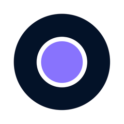

  

# OmniCam keyboard shortcuts and controls

Shortcuts are live only while the OmniCam viewport or timeline has focus. They
never capture the keyboard while you are typing into a field, and OmniCam
claims a key from ComfyUI only when it actually handles it
(`web-src/commands.js`). `Space` and `Enter` are also left alone when focus sits
on something that activates with them -- a button, a disclosure `summary`, an
outliner row or the axis gizmo -- so the panels stay keyboard-operable.

Keys are scoped to the zone the event came from: the **viewport** owns the
spatial keys, the **timeline / graph editor** own the temporal keys, and the
**sequence editor** owns its own. Only a small transport set (undo/redo,
copy/paste, duplicate, `Space`, `Escape`) fires from any zone.

## Viewport navigation

Every camera gesture has **at least two independent bindings, and none of the
primary ones needs `Alt`**. That is deliberate: `Alt` never reaches the page on
a number of real setups -- a Linux window manager that claims `Alt` + drag to
move windows, a desktop shell that opens its menu bar on `Alt`, or a keyboard
whose right `Alt` is `AltGr` (which reports `Ctrl`+`Alt`, not `Alt`). A viewport
whose only orbit lives behind `Alt` is simply not navigable there.

| Gesture | Primary (no `Alt`) | `Alt` aliases | Left button only |
|---|---|---|---|
| Orbit | Middle drag | `Alt` + left | `Ctrl`/`Cmd` + drag over empty space |
| Pan | `Shift` + middle | `Alt` + middle, `Alt`+`Shift` + left | `Ctrl`+`Shift` + drag over empty space |
| Dolly | `Ctrl`/`Cmd` + middle, mouse wheel | `Alt` + right (Maya), `Alt`+`Ctrl` + left | Mouse wheel |

The middle-button family is Blender's, needs no modifier at all, and is what
this node's timeline and curve editor already use to pan. The `Ctrl` + left
fallbacks are for hardware with no middle button; they only fire over **empty
space**, so multi-select (`Ctrl` + *click*, which reaches the picker first) is
untouched.

The profile chosen in the toolbar's **Navigation & Selection** menu (seeded per
node by *Settings → OmniCam → Navigation*) now only decides one thing: `Alt` +
right drag dollies in **Maya**, while **Blender** binds no camera gesture to the
secondary button. Every other gesture above is identical in both.

`Alt`/`Option` always means navigation and never opens a menu: an
`Alt` + right drag dollies without the context menu appearing on release.
An orthographic view has no orbit to give, so every orbit gesture pans there
instead; an unmodified drag still starts a marquee, as in perspective.

Explicit navigation gestures preserve the current selection, even when started
over an object or gizmo. In Fly mode, a primary drag looks around in both
profiles. The status bar identifies Orbit, Pan, Dolly or Fly while starting a
navigation gesture. Pan uses the displayed viewport size and camera FOV; wheel
input is normalized for devices reporting pixels, lines or pages.

`F` fits all selected visible objects with a margin, accounting for the viewport
aspect ratio and orthographic zoom. Loaded geometry bounds are used when
available, with animated world transforms as the fallback.

`Escape` cancels the current drag or marquee. A click without movement does not
consume an undo step. Losing pointer capture cancels the gesture and clears its
cursor/capture state, so the next interaction starts cleanly.

| Control | Action |
|---|---|
| Mouse wheel | Dolly in / out |
| Double-click in the viewport | Place the camera target under the cursor |
| `F` or `Numpad .` | Frame the selection (or the target) |
| `A` or `Home` | Frame every visible object (Maya `A`, Blender `Home`) |
| `C`, or `Shift` + `` ` `` | Toggle Fly mode |
| `W` `A` `S` `D` `Q` `E` (Fly mode only) | Fly move; `Shift` flies faster |
| Mouse wheel (Fly mode) | Adjust fly speed |
| Axis tripod (top right) | Click an axis tip to snap to that orthographic view. Click again to flip. Click the purple center to frame selection. |
| Drag (Fly mode) | Look around; `Esc` or `C` exits Fly |
| `Numpad 0` | Active-camera view |
| `Numpad 1` / `Ctrl`/`Cmd` + `Numpad 1` | Front / back view |
| `Numpad 3` / `Ctrl`/`Cmd` + `Numpad 3` | Right / left view |
| `Numpad 7` / `Ctrl`/`Cmd` + `Numpad 7` | Top / bottom view |
| `Numpad 9` | Flip to the opposite view (half turn from a free view) |
| `Numpad 4` / `Numpad 6` | Orbit left / right by 15 degrees |
| `Numpad 8` / `Numpad 2` | Orbit up / down by 15 degrees |
| `Numpad 5` | Toggle camera / perspective view |
| `N` | Toggle the Inspector panel |

Outside Fly mode, `W` `Q` `E` deliberately carry no competing tool command.
`A` frames the scene outside Fly mode and strafes left inside it.

## Selection and transformation (viewport zone)

| Shortcut | Action |
|---|---|
| Click | Select an object |
| `Shift`/`Ctrl`/`Cmd` + click | Add / remove from the selection |
| Left drag in empty space | Marquee selection (both profiles) |
| Hold `Shift` when the marquee starts | Additive marquee |
| `Shift` + `G` | Select the active object and all its descendants |
| `T` | Modal translate |
| `R` | Modal rotate |
| `S` | Modal scale |
| `X` `Y` `Z` during `T`/`R`/`S` | Constrain or release the axis |
| digits, `-`, `.` or `,` during `T`/`R`/`S` | Type an exact value |
| `Shift` during a transform | Precision movement |
| `Enter` or left click | Confirm the transform |
| `Escape` or right click | Cancel the transform |
| `Tab` | Toggle Object Mode / Component Mode |
| `1` `2` `3` `4` (not numpad) | Component select mode: vertex / edge / face / object |
| `H` / `Alt`+`H` | Hide the selected object / show all |
| `Delete` / `Backspace` | Delete the selected object or camera |

The toolbar's **Transform space** (World / Local) applies to **Move only**.
Scale and Rotate always use the object's own axes, as Maya's own manipulators
do, because that is the only frame their stored data has: handle *N* writes
`size[N]` or `rotation[N]`, a size triple lives in the object's frame, and an
XYZ euler composes as `Rz*Ry*Rx` so `rotation[0]` is a turn about the object's
own X. Drawing those handles along world axes promised a transform the data
cannot perform -- a world scale shears, and a world rotation has to recompose
the euler -- so a cube turned 90 degrees on Z grew and spun about the axis next
to the one whose handle was grabbed.

`T`/`R`/`S` transform every selected object around their shared pivot. Locked
objects stay selectable but are not transformed. The toolbar's **Spatial Snap**
menu is independent of the timeline's temporal snapping: **Grid** snaps to the
configured step, **Vertex** snaps the selection pivot to a visible vertex, and
holding `Ctrl`/`Cmd` engages the grid temporarily.

## Animation and editing

| Shortcut | Action |
|---|---|
| `I` or `K` | Insert / replace a keyframe at the current frame |
| `Space` | Play / stop |
| `←` / `→` | Previous / next frame |
| `↑` / `↓`, `.` / `,`, or `Shift` + `→` / `Shift` + `←` | Previous / next keyframe |
| `Delete` / `Backspace` (timeline zone) | Delete the selected keyframe |
| `Ctrl`/`Cmd` + `C` / `V` | Copy / paste a keyframe |
| `Ctrl`/`Cmd` + `D` | Duplicate the selected object or camera |
| `Ctrl`/`Cmd` + `Z` | Undo (viewport history) |
| `Ctrl`/`Cmd` + `Shift` + `Z`, or `Ctrl`/`Cmd` + `Y` | Redo |

`Home` / `End` select the **first / last keyframe** in the timeline and graph
zones. In the sequence editor they jump to frame 0 / the last frame instead.

Playback in / out points are set with the two range buttons in the transport
bar (`web-src/event-bindings/transport-media.js`); there is no keyboard
shortcut for them.

## Extractor transport

When focus is inside the **OmniCam Extractor** timeline (and not in a text or
number field), its read-only transport uses the source-frame clock:

| Shortcut | Action |
|---|---|
| `Space` | Play / stop source playback |
| `←` / `→` | Previous / next frame |
| `Home` / `End` | First / last source frame |

The Extractor transport's previous/next-key buttons visit detected anomaly
frames first, then solved camera keyframes. Drag anywhere across its ruler,
solve-health band, or channel lanes to scrub; the fixed lane-label gutter is
not part of the scrub range.

In the Extractor 3D tab, `SCENE` is the orbitable path and frustum inspection
view. `CAMERA` is the solved camera at the current source frame; scene view
presets and Fit Track are disabled while it is active.

## Timeline and Curve Editor

| Control | Action |
|---|---|
| Click / drag the ruler or the timeline | Scrub frames |
| Click a channel diamond | Jump to that key and select it |
| Graph Editor / Dope Sheet tabs | Switch the lower-panel view |
| Drag a key | Move it in time |
| `Shift` + click | Add a key to the selection |
| `Shift` + drag in empty space | Marquee-select keys |
| `Alt`/`Option` + drag a key | Duplicate and move the key |
| Mouse wheel | Time zoom |
| Middle drag, or `Alt`/`Option` + drag | Pan |
| Drag a point or tangent | Change the value or the interpolation |

## Sequence editor (Advanced interface tier)

Active only when the sequence editor zone has focus:

| Shortcut | Action |
|---|---|
| `←` / `→` | Previous / next frame |
| `Home` / `End` | Frame 0 / last frame |
| `S` | Split the shot at the playhead (auto-split if there are no cuts yet) |
| `A` | Auto-split the whole timeline into shots |
| `Delete` / `Backspace` | Remove the shot under the playhead |

## Viewport chrome

The vertical rail left of the viewport holds the select tool, the
translate / rotate / scale gizmos, the four component select modes, frame-target
and the side-panel toggle. The pills at top-left choose the view and the active
camera; the top-right corner shows the zoom and the full-screen toggle, which
hides the panels down to the image alone.

Below that corner, the axis gizmo shows world orientation — X red, Y green,
Z blue. The axis pointing toward you carries its letter; the one pointing away
is a dimmed dot. It is an SVG overlay, not a WebGL pass, so it never appears in
the playblast, which stays a neutral motion reference.

## Mini-radar

*Display → 2D Radar Mini-Map* draws a top-down map at the bottom-right of the
viewport: every camera path (active one highlighted), the active camera's
position and view cone, the target, scene objects, trajectory keys and an
altitude dot coloured by height band. The scale adapts to keep the paths, the
camera and the target in frame. The radar is never drawn during a playblast.

## Manual viewport QA

1. Create three centred objects, lock one, and multi-select.
2. Run `T X 2 Enter`, `R Z 45 Enter`, `S 1.5 Enter`, then Undo / Redo.
3. Test Grid and Vertex snapping without changing the timeline snap.
4. Test the additive marquee and `Shift`+`G` on a hierarchy.
5. Switch Maya / Blender and check orbit, pan and dolly in each profile.
6. Enter Fly with `C`, move with `W`/`A`/`S`/`D`/`Q`/`E`, exit with `Esc`.
7. Alt-drag over an object in Maya; check that the selection stays unchanged.
8. Frame two distant objects with `F` in perspective and front views, including
   a narrow viewport. Both objects must fit; Undo must restore the prior view.
9. Cancel a navigation drag and a Blender marquee with `Esc`; then start another
   drag. A stationary click followed by `Esc` must preserve the previous edit.
10. Compare pan at different display scales and wheel/trackpad zoom. Save and
    reload the workflow; the editor view and authored camera must survive.
