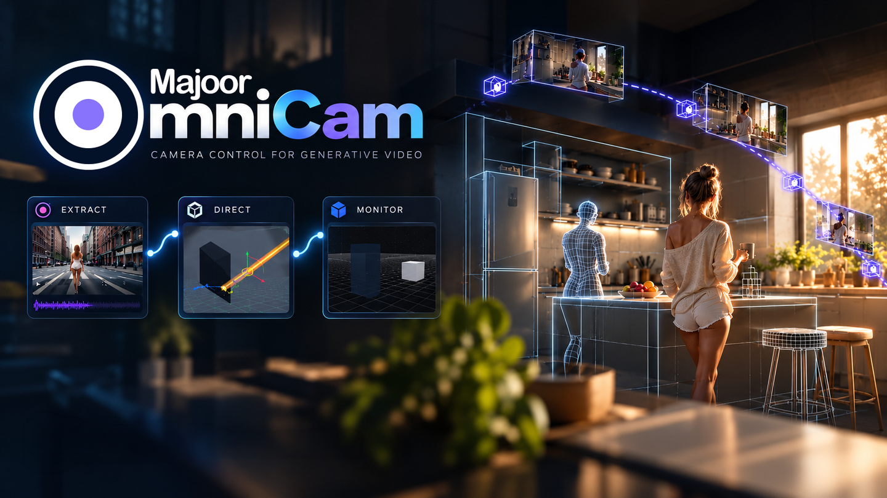
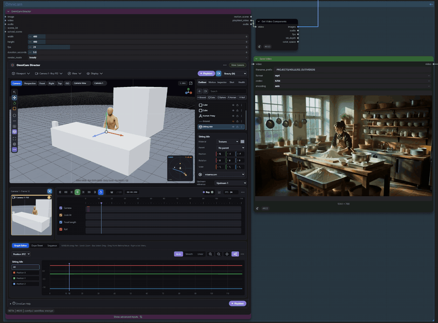

<p align="center">
  
</p>

# OmniCam User Guide

All three nodes are marked **experimental** in ComfyUI. Camera authoring and the
playblast are stable in practice; the **Monitor** profile set and the Director
**Motion Tracks** surface may still change before a stable release.



The full graph — Extractor, Director and Monitor wired end to end — is in
[`assets/omnicam-overview.png`](assets/omnicam-overview.png); a longer
walkthrough is [`assets/omnicam-preview.mp4`](assets/omnicam-preview.mp4).

## Author a Camera Move

1. Add **OmniCam Director**.
2. Compose the opening frame in the 3D viewport.
3. Press `I` to insert a camera keyframe.
4. Move the playhead, reposition the camera, then press `I` again.
5. Press `Space` to preview the shot.
6. Record a playblast when a reference-video workflow needs one.

Director keeps the authored **MotionScene** as the canonical scene state; each
camera carries its own versioned camera track. The playblast is a motion
reference, not a final render.

## Recover Motion from Video

1. Add **OmniCam Extractor**.
2. Connect one continuous video shot.
3. Use `auto` to prefer DPVO, then `pycolmap`, then `opencv_sift` -- or select one of the three directly.
4. Review Solver Coverage and the report.
5. Connect `motion_scene` to the Director's `solved_scene` input to keep editing the recovered move, or straight to Monitor to deliver it.

Extractor returns relative camera motion. It does not reconstruct metric scene scale or stitch across hard cuts.

## Reconstruct 3D Scene from an Image

1. Add **OmniCam Extractor**.
2. Connect an image (via `Load Image` or any `IMAGE` socket).
3. Switch the Extractor panel mode to **Scene Reconstruct**.
4. Choose a quality preset:
   - **Fast**: 360px resolution, 32k triangle budget — quick turnaround.
   - **Balanced** (default): 512px resolution, 64k triangle budget — balanced detail.
   - **High**: 720px resolution, 120k triangle budget — fine geometry contours.
5. Choose detection options:
   - **Ground Plane**: detects the dominant floor plane with RANSAC and adds a calibrated ground proxy.
   - **Wall Planes**: fits vertical surface planes (disabled by default).
   - **Source Texture**: embeds the image UV texture into the proxy GLB.
6. Click **Reconstruct Scene** to run geometry estimation interactively (runs outside the Comfy prompt queue).
7. Click **Open in Director** to adopt the reconstructed environment mesh and camera hold into the Director viewport.

In Director, reconstructed objects appear locked by default to prevent accidental moves, with confidence badges (`High`, `Medium`, `Low`) reflecting estimation inlier ratios. Toggle **Reconstruction Appearance** between `Neutral` (ideal for `omni_ref` conditioning playblasts) and `Source Texture` (for interactive shot staging).


## Deliver to a Video Workflow

1. Connect `motion_scene` from Director or Extractor to **OmniCam Monitor**.
2. Connect `playblast_video` as well. Reference-video profiles require it, and
   every profile uses it for the preview.
3. Choose the `target_profile` your downstream model needs.
4. Queue, then read the preflight. Anything `BLOCKED` stops the compile and says
   why; resolve it before wiring the output.
5. Wire the one output that profile populates:
   - `reference_video`, plus `final_prompt`, for `external_reference_video` or `h3_api`
   - `reference_frames`, plus `final_prompt`, for `h3_native`
   - `camera_embedding` for `wan_camera_native`
   - `native_tracks` for `wan_move_native`
   - `tracks_json` for `wan_track_native`, `wanvideo_ati`, `ltx25_motion_track`

`external_reference_video` applies no model-specific contract: no frame grid, no
fps conversion, no required downstream node, and it never blocks. Use it for a
model OmniCam has no named profile for -- Seedance, Kling, Veo, a private API.
Choose a named profile only when you want OmniCam to enforce that model's exact
contract and block the compile when the scene or the connected media cannot
satisfy it.

Switching profile never changes the MotionScene. It does change which Monitor output carries the result, so connect the one listed above for the profile you selected.

The player above the preflight shows the Director's actual recorded playblast,
not its live edit viewport. If the scene has changed since that file was
recorded, it reads `PLAYBLAST OUTDATED` — the compile still sends the old
footage until you re-record.

Use the [Node Guide](NODES.md) for exact sockets and profile requirements, and
[`examples/workflows/`](../examples/workflows) for a ready-made graph per family.

## Interface Modes

Director offers Basic, Animation, and Advanced interface modes. They reveal progressively more of the same shot editor; camera data and workflow serialization remain unchanged.

Use [Shortcuts](SHORTCUTS.md) for the complete viewport and timeline control reference.

## Install

For normal use, install Majoor OmniCam through **ComfyUI Manager → Custom Nodes
Manager** (search for *Majoor OmniCam*), or with a plain clone into
`custom_nodes/`:

```bash
cd ComfyUI/custom_nodes
git clone https://github.com/MajoorWaldi/ComfyUI-Majoor-OmniCam.git
```

The Vite frontend output (`web/`, `web-chunks/`) is committed, so both routes
work with no build step. Restart ComfyUI, then install whichever optional
Extractor backends you need (below). There are no required Python packages
beyond ComfyUI's own.

Contributors editing `web-src/` do need the toolchain — Node.js 22, then
`npm ci && npm run build` to regenerate the bundle. Rollup's content hashes are
not byte-reproducible across operating systems, so a rebuild on another platform
will churn the `web-chunks/` filenames.

All three Extractor backends are optional. DPVO requires a compatible local
installation and its checkpoint at:

```text
ComfyUI/models/omnicam/dpvo/dpvo.pth
```

pycolmap needs nothing beyond `python_embeded\python.exe -m pip install pycolmap`
-- no compiler, no CUDA toolkit, prebuilt Windows wheels. OpenCV/SIFT needs
`opencv-python`. `auto` tries DPVO, then pycolmap, then OpenCV/SIFT, and uses
the first one actually installed. See
[Installing DPVO](TECHNICAL_REFERENCE.md#installing-dpvo) for the DPVO build
procedure, and the rest of the [Technical Reference](TECHNICAL_REFERENCE.md)
for runtime details.

### Geometry Estimation (Scene Reconstruction)

Scene Reconstruction uses ComfyUI's native geometry estimation backend (`comfy_extras.nodes_moge`). It requires a MoGe checkpoint placed in:

```text
ComfyUI/models/geometry_estimation/
```

OmniCam adheres to a strict **no auto-download policy**: models and packages are never downloaded automatically in the background. If the checkpoint is absent, Extractor surfaces clear setup instructions while camera-tracking continues to operate normally.

## Help and Troubleshooting

Use the `?` button for concise help about the selected OmniCam node. For detailed contracts, profile compatibility, and managed-file behavior, see the [Node Guide](NODES.md), [Compatibility Guide](COMPATIBILITY.md), and [Security Guide](SECURITY.md).